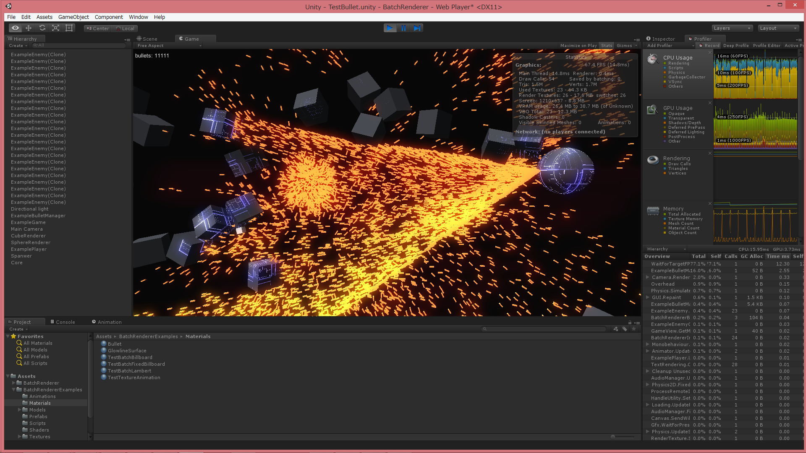
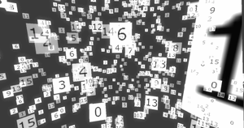
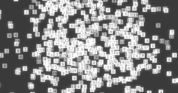

# BatchRenderer
  
Unity で大量のオブジェクトを描画できるようにするスクリプトです。パーティクル、弾幕などの描画に威力を発揮します。割とポータブルな作りになっており、D3D11、D3D9、OpenGL、OpenGL ES、PS4 などで動作します。  
[動作例](http://primitive-games.jp/Unity/CSharpBullet.html)
  
  
##### 使い方
まず BatchRenderer コンポーネントを適当なオブジェクトに追加します。  
  
描画したいモデルを mesh に設定します。あまり頂点数が多くないモデルが望ましいです。  
マテリアルを material に設定します。このマテリアルは BatchRenderer/ 以下のシェーダを使ったものである必要があります。  
あとはスクリプトから BatchRenderer.AddInstance() 一族でインスタンスを追加すれば、追加した数だけそれが描かれます。  

enable_rotation から enable_uv_offset までのチェックは、各インスタンスに持たせる情報です。  
enable_rotation をチェックすると各インスタンスの個別の回転が有効になる、といった具合です。この場合、AddInstanceTR() などの回転を渡せるバージョンの AddInstance() 一族でデータを追加します。  
これらはチェックすると GPU に渡すデータが増えて遅くなるので、使わないものはチェックしないようにするのが望ましいです。  

##### シェーダについて
前述のように、マテリアルには BatchRenderer 以下のシェーダを使う必要があります。  
Lambert や BlinnPhong は通常の 3D オブジェクトを描くためのものです。  

Billboard 系のシェーダはビルボードを実現するためのもので、常にカメラを向くようになります。  
基本的に板ポリゴン (Assets/BatchRenderer/Meshes/quad.asset) をメッシュに使いますが、板ポリゴン以外にも適用できます。   
  
enable_uv_offset で UV オフセットを有効にすることで、スクリーンショットのようにテクスチャアニメーションもできます。  
BatchRenderer 自身はソートはしないので、Billboard に限らず半透明オブジェクトを描く際は描画順に注意が必要です。(AddInstance() した順に描くようになっています)
  
FixedBillboard 系のシェーダもビルボードを実現するものですが、こちらは表示の中心位置に 3D 座標を使う以外は 2D 的な振る舞いをします。  
スクリーンショットを見比べるとどういうことかわかりやすいと思います。下のスクリーンショットは上の Billboard と同じシーンで、シェーダだけが違います。Billboard だとパースがかかっている一方、FixedBillboard はかかっていないのが見て取れると思います。  
  
FixedBillboard 系のシェーダを使う場合、モデルの描画には画面左端が -1.0、右端が 1.0 の座標系が使われます。(上下はアスペクト比により変動)  
例えば、付属の quad モデルは左端が -0.5、右端が 0.5 なので、これをそのままの大きさで画面に出すと横幅がちょうど画面の半分の大きさになります。2 倍のスケールにするとちょうど画面を覆う大きさになります。  

より技術的な詳細に興味があれば、[こちらの記事](http://i-saint.hatenablog.com/entry/2015/02/08/225227)もご参照ください。
